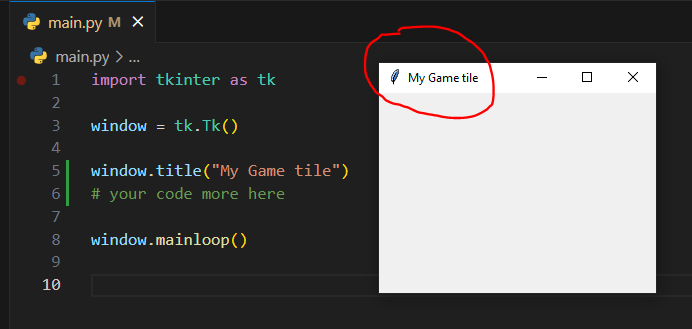

## Tkinter basic note

#### Import Tkinter library
```python
import tkinter as tk
```

#### Create basic tkinter Window object
```python
import tkinter as tk

window = tk.Tk()

# Your code here
window.mainloop()
```

#### Examples:


#### Create title on window
```python
import tkinter as tk

window = tk.Tk()

# create title on window
window.title("My Game Title")

# Your code more here

window.mainloop()
```

#### Examples:



#### Identify window size
```python
import tkinter as tk

# create window object
window = tk.Tk()

# create title on window
window.title("My Game tile")

# Window size
window.geometry("300x400")

# your code more here

# Build the window object
window.mainloop()

```
#### Examples:


#### Create text label in window
```python
import tkinter as tk

# create window object
window = tk.Tk()

# create title on window
window.title("My Game tile")

# Window size
window.geometry("300x400")

# create text label in window
label = tk.Label(window, text="Text in window")

# To display text label
label.pack()

# your code more here

# Build the window object
window.mainloop()
```

#### Examples:

